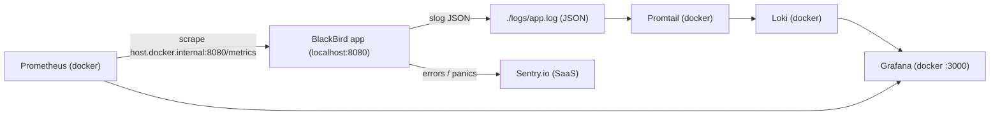

# Logging & Monitoring

This document describes the observability stack added to BlackBird: structured
logging, Prometheus metrics, Loki log aggregation, Grafana dashboards, and
Sentry error tracking.

The application runs locally (`go run ./cmd/server`); the monitoring backends
run in Docker via `monitoring/docker-compose.yml`.

## Overview

| Signal  | How it is produced                                                  | Where to view it                    |
| ------- | ------------------------------------------------------------------- | ----------------------------------- |
| Logs    | Structured JSON (`slog`) to stdout + rotating `./logs/app.log`      | Grafana Explore (via Loki/Promtail) |
| Metrics | Prometheus client at `GET /metrics`                                 | Prometheus + Grafana dashboard      |
| Errors  | Sentry SDK (panics + 5xx), enriched with `request_id`               | sentry.io project (when DSN set)    |



## Quick start

```sh
# 1) Start the monitoring backends
docker compose -f monitoring/docker-compose.yml up -d

# 2) Run the app (writes JSON logs to ./logs/app.log and serves /metrics)
go run ./cmd/server
```

Endpoints / UIs:

- App: `http://localhost:8080`
- Metrics: `http://localhost:8080/metrics`
- Prometheus: `http://localhost:9090`
- Loki: `http://localhost:3100`
- Grafana: `http://localhost:3000` (login `admin` / `admin`)

Tear down with `docker compose -f monitoring/docker-compose.yml down`
(add `-v` to also delete stored data volumes).

## 1. Structured logging (slog)

JSON logs are emitted to **stdout** and a **rotating file** at `./logs/app.log`.

- Logger setup: `internal/observability/logging/logger.go`
  - JSON `slog.Logger`, level from `LOG_LEVEL`.
  - Dual sink via `io.MultiWriter(os.Stdout, file)`.
  - File rotation with lumberjack (50 MB, 5 backups, 28 days, compressed).
  - Constant attributes `service=blackbird` and `env` on every record.
- Request logging middleware: `internal/api/http/middleware/logger.go`
  - `RequestLogger(logger)` emits one structured line per request.
  - Fields: `request_id`, `method`, `path`, `status`, `bytes`, `duration_ms`,
    `remote_ip`, `user_agent`.
  - Log level scales with status: `INFO` (<400), `WARN` (4xx), `ERROR` (5xx).
- Wiring: `cmd/server/main.go` builds the logger and calls `slog.SetDefault`;
  all previous `log.*` fatal calls were replaced with `logger.Error` + `os.Exit(1)`.

Example line:

```json
{"time":"2026-06-02T23:26:36.52+05:00","level":"INFO","msg":"http_request","service":"blackbird","env":"development","request_id":"...-000002","method":"POST","path":"/auth/register","status":201,"bytes":73,"duration_ms":124.664,"remote_ip":"[::1]:18871","user_agent":"..."}
```

## 2. Prometheus metrics

- Code: `internal/observability/metrics/metrics.go`
- Endpoint: `GET /metrics` (registered in `internal/api/http/server.go`)
- Middleware: `metrics.Middleware` records every request.

Metrics exposed (namespace `blackbird`):

| Metric                                        | Type      | Labels                  |
| --------------------------------------------- | --------- | ----------------------- |
| `blackbird_http_requests_total`               | counter   | `method`, `route`, `status` |
| `blackbird_http_request_duration_seconds`     | histogram | `method`, `route`       |
| `blackbird_http_requests_in_flight`           | gauge     | -                       |

The `route` label uses the **chi route pattern** (e.g. `/users/{id}`) instead
of the raw path, so IDs don't explode label cardinality.

Prometheus scrape config: `monitoring/prometheus/prometheus.yml` scrapes
`host.docker.internal:8080/metrics` every 15s.

Useful PromQL:

```promql
# request rate per route
sum by (route) (rate(blackbird_http_requests_total[1m]))

# 5xx error rate
sum(rate(blackbird_http_requests_total{status=~"5.."}[1m]))

# p95 latency
histogram_quantile(0.95, sum by (le) (rate(blackbird_http_request_duration_seconds_bucket[5m])))
```

## 3. Loki log aggregation

The app writes JSON logs to `./logs/app.log`. Promtail (in Docker) tails that
file and ships entries to Loki.

- Loki config: `monitoring/loki/loki-config.yml` (single binary, filesystem storage).
- Promtail config: `monitoring/promtail/promtail-config.yml`
  - Mounts host `../logs` to `/var/log/blackbird`.
  - Parses the slog JSON, sets the log timestamp from `time`, and adds a `level` label.
  - Static labels: `job=blackbird`, `service=blackbird`.

Query logs in Grafana Explore (Loki datasource):

```logql
{job="blackbird"} | json
{job="blackbird"} | json | status >= 400
```

## 4. Grafana

Grafana is provisioned automatically (no manual setup):

- Datasources: `monitoring/grafana/provisioning/datasources/datasources.yml`
  - `Prometheus` (uid `prometheus`, default)
  - `Loki` (uid `loki`)
- Dashboard provider: `monitoring/grafana/provisioning/dashboards/dashboards.yml`
- Dashboard JSON: `monitoring/grafana/dashboards/blackbird-http.json`
  - "BlackBird - HTTP Overview": request rate by route, 4xx/5xx error rate,
    p50/p95/p99 latency, requests in-flight, total requests, and a live Loki
    log panel.

## 5. Sentry error tracking

- Code: `internal/observability/sentryobs/sentry.go`
- Init: `cmd/server/main.go` (after the logger, with `defer Flush`).
- Mode: **sentry.io SaaS** - set `SENTRY_DSN` to enable. When the DSN is empty,
  Sentry is fully disabled (no-op) and the app runs normally.

Behavior:

- Panics are captured by the `sentryhttp` middleware and re-raised, so chi's
  `Recoverer` still returns a 500 to the client.
- Server-side errors (5xx responses) are reported as Sentry events tagged with
  `request_id`, `http.method`, `http.path`, and `http.status`.
- The middleware is only registered when Sentry is enabled (see
  `internal/api/http/server.go`).

Test: `internal/observability/sentryobs/sentry_test.go` verifies that both a
5xx response and a panic produce Sentry envelopes against a fake ingest
endpoint (no real DSN required). Run with:

```sh
go test ./internal/observability/sentryobs/...
```

## Configuration

All settings are read in `internal/config/config.go`. New variables:

| Variable                     | Default            | Description                                        |
| ---------------------------- | ------------------ | -------------------------------------------------- |
| `LOG_LEVEL`                  | `info`             | `debug` / `info` / `warn` / `error`                |
| `LOG_FILE`                   | `./logs/app.log`   | JSON log file path (tailed by Promtail)            |
| `SENTRY_DSN`                 | _(empty)_          | sentry.io DSN; empty disables Sentry               |
| `SENTRY_ENVIRONMENT`         | value of `ENV`     | Environment tag reported to Sentry                 |
| `SENTRY_TRACES_SAMPLE_RATE`  | `0.0`              | Performance trace sampling (0.0-1.0)               |

See `.env.example` for the full template.

## Files added / changed

New:

- `internal/observability/logging/logger.go`
- `internal/observability/metrics/metrics.go`
- `internal/observability/sentryobs/sentry.go`
- `internal/observability/sentryobs/sentry_test.go`
- `monitoring/docker-compose.yml`
- `monitoring/prometheus/prometheus.yml`
- `monitoring/loki/loki-config.yml`
- `monitoring/promtail/promtail-config.yml`
- `monitoring/grafana/provisioning/datasources/datasources.yml`
- `monitoring/grafana/provisioning/dashboards/dashboards.yml`
- `monitoring/grafana/dashboards/blackbird-http.json`
- `.env.example`

Changed:

- `cmd/server/main.go` - logger + Sentry init, slog-based fatal logging.
- `internal/api/http/server.go` - wired logging/metrics/sentry middleware, `/metrics`.
- `internal/api/http/middleware/logger.go` - structured `RequestLogger`.
- `internal/config/config.go` - new log + Sentry config fields.
- `.gitignore` - ignore `logs/` and build binaries.
- `README.md` - Observability section.

New dependencies (`go.mod`):

- `gopkg.in/natefinch/lumberjack.v2` - log file rotation
- `github.com/prometheus/client_golang` - metrics
- `github.com/getsentry/sentry-go` - error tracking

## Notes & caveats

- The scrape config relies on Docker Desktop's `host.docker.internal`; the
  compose file also maps it to the host gateway for plain Linux.
- Rate limiting is in-memory per instance; `/metrics` is subject to it but the
  default 100 req / 60s easily covers a 15s scrape interval.
- The refresh-token cookie is `Secure`, so `/auth/refresh` over plain HTTP will
  fail to send the cookie (use HTTPS for local refresh testing). This is
  unrelated to observability.
