# Database Migration

## Development

```sh
go install github.com/golang-migrate/migrate/v4/cmd/migrate@latest

go install -tags 'postgres' github.com/golang-migrate/migrate/v4/cmd/migrate@latest
```

Then run the following command to apply the migrations:

```sh
./bin/db-migrate.sh
```

## Production

```sh
go get -u github.com/golang-migrate/migrate/v4
go get -u github.com/golang-migrate/migrate/v4/database/pgx
go get -u github.com/golang-migrate/migrate/v4/source/file
```

# Chi Router

This is setting up a Chi router in Go and attaching a chain of middleware. Every incoming HTTP request will pass through these middleware in the order they are registered.

```
r := chi.NewRouter()
```

Creates a new router instance.

---

```
r.Use(chimid.RequestID)
```

Adds a unique request ID to every request.

Example:

```
X-Request-ID: a1b2c3d4
```

Useful for tracing logs across services.

---

```
r.Use(chimid.RealIP)
```

Extracts the real client IP from headers such as:

```
X-Forwarded-For
X-Real-IP
```

Important when your application is behind a reverse proxy, load balancer, or API Gateway.

Without it:

```
RemoteAddr = Load Balancer IP
```

With it:

```
RemoteAddr = Actual User IP
```

---

```
r.Use(chimid.Recoverer)
```

Protects your server from crashing due to panics.

Without Recoverer:

```
panic("something broke")
```

could terminate the request and potentially affect the server.

With Recoverer:

- Panic is caught
- Stack trace is logged
- HTTP 500 returned
- Server keeps running

```
r.Use(apimiddleware.Logger)
```

---

Custom logging middleware.

Typically logs:

```
GET /users 200 15ms
POST /login 401 8ms
```

May also log:

- Request ID
- IP Address
- User Agent
- Response time

depending on implementation.

```
r.Use(apimiddleware.RateLimit(
    cfg.RateLimitRequests,
    cfg.RateLimitWindow,
))
```

---

Custom rate-limiting middleware.

Example configuration:

```
RateLimitRequests = 100
RateLimitWindow   = time.Minute
```

Meaning:

```
100 requests per minute per IP
```

If exceeded:

```
HTTP/1.1 429 Too Many Requests
```

# SQL Structure

This is safe from SQL injection as written.

The SQL is static and embedded at build time via //go:embed, so it is not constructed from user input.

The query uses positional parameters ($1…$7) and QueryRowContext binds arguments separately, so user input cannot change the SQL structure.

# Authentication Flow



# SQL Connection Pool And Context

## 1. sql.Open does not create a connection

This is the most common misconception in Go.

```go
godb, err := sql.Open("pgx", cfg.DatabaseURL)
// db is NOT a connection.
// It is a CONNECTION POOL MANAGER.
// No actual TCP connection to Postgres has been made yet.

db.PingContext(ctx)
// THIS creates the first real connection — just to test reachability.
// Then returns it to the pool.
```

*sql.DB is a pool. It works like this:

```go
*sql.DB (the pool)
├── idle connections:   [conn1] [conn2] [conn3]   ← sitting ready, reusable
├── in-use connections: [conn4] [conn5]            ← currently running queries
├── MaxOpenConns: 25    ← never more than 25 total at once
└── MaxIdleConns: 5     ← keep at most 5 idle connections alive
```

When QueryContext is called:

```go
Request comes in
    │
    ▼
pool has idle connection?
    ├── YES → hand it to the query, run it, return it to pool when done
    └── NO  → total connections < MaxOpenConns?
                  ├── YES → create new connection, run query, return to pool
                  └── NO  → wait until one becomes available
```

So across 100 simultaneous requests, you might only have 10-25 actual Postgres connections. Not 100. That is the entire point of pooling.
You should set these in main.go right after sql.Open:

```go
godb, err := sql.Open("pgx", cfg.DatabaseURL)

// tune the pool — these are sensible defaults for a small auth server
db.SetMaxOpenConns(25)
db.SetMaxIdleConns(5)
db.SetConnMaxLifetime(5 * time.Minute)  // don't hold stale connections forever
```

## 2. What ctx actually is
Context is how Go propagates three things down a call chain:

```
Cancellation  →  "stop what you're doing, the caller gave up"
Deadline      →  "stop if you haven't finished by this time"
Values        →  request-scoped data (request ID, user info, etc.)
```

In main.go you create a one-off context just for the ping:

```go
goctx, cancel := context.WithTimeout(context.Background(), 5*time.Second)
defer cancel()
db.PingContext(ctx)
// "if Postgres doesn't respond in 5 seconds, give up and crash"
// this context is ONLY used for startup — it has nothing to do with request handling
```

In request handling the context comes from the HTTP request itself:

```go
func (h *Handler) Login(w http.ResponseWriter, r *http.Request) {
    r.Context()
    // this context is ALIVE for exactly as long as the HTTP request is alive
    // if the user closes their browser mid-request, this context is cancelled
    // any DB query using it will be cancelled too — no wasted work
}
```

The context flows down through every layer automatically:

```
HTTP Request arrives
    │
    r.Context() ← born here, tied to this request's lifetime
    │
    ▼
Handler: h.userSvc.Authenticate(r.Context(), email, password)
    │
    ▼
Service: s.repo.FindByEmail(ctx, email)
    │
    ▼
Repository: db.QueryContext(ctx, "SELECT * FROM users WHERE email = $1", email)
    │
    ▼
Postgres driver: runs query, but WATCHES the context
    └── if ctx cancelled before query finishes → driver cancels the query
        Postgres gets a cancellation signal → stops the work
        No result is returned up the chain
```

## The full picture in one view

```
main.go
  sql.Open() → creates *sql.DB (the pool, no real connections yet)
  db.PingContext(5s ctx) → first real connection, tests DB is alive
  
  appRepo := NewAppRepository(db)   ← all repos share THE SAME POOL
  userRepo := NewUserRepository(db) ←
  roleRepo := NewRoleRepository(db) ←
  tokenRepo := NewTokenRepository(db) ←

  NewServer(..., appSvc, ...) → DynamicCORS gets appSvc.GetOrigins as a function

─────────────────────────────────────────────────────────
HTTP Request: GET /api/products
Origin: https://blackbird.app

  r.Context() born ──────────────────────────────────────────┐
                                                             │
  DynamicCORS runs                                           │
    isAllowed(r.Context(), "https://blackbird.app")          │
      cache hit → true → no DB query → ctx never used        │
      cache stale → appSvc.GetOrigins(ctx) ─────────────────►│
                      repo.ListOrigins(ctx) ────────────────►│
                        db.QueryContext(ctx, SQL) ──────────►│
                          pool grabs idle conn               │
                          runs query                         │
                          returns conn to pool               │
                          ◄── []string{"https://blackbird.app"} 
      cache rebuilt
      "https://blackbird.app" found → true

  CORS headers set
  next.ServeHTTP(w, r) → handler runs
  
  Request ends → r.Context() cancelled ───────────────────────┘
                 (if query was still running, it would stop here)
```

`The key insight:` db is passed once to every repository at startup. After that, every QueryContext(ctx, ...) call just borrows a connection from the pool, uses it, and hands it back. The request context flowing through is purely for cancellation — it has no effect on which connection from the pool gets used.